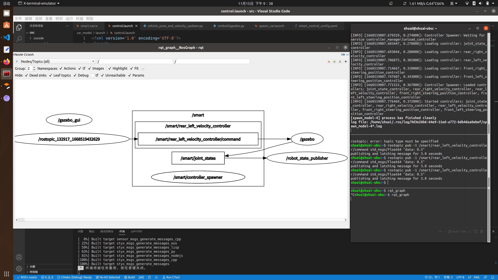
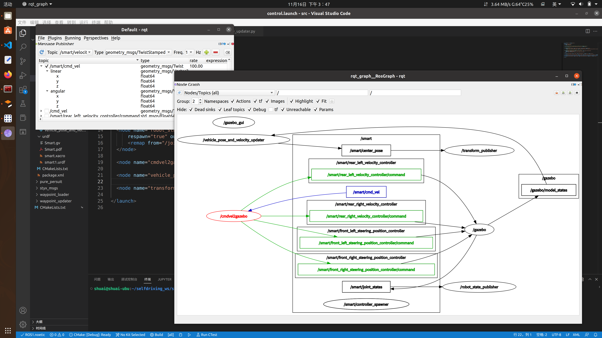
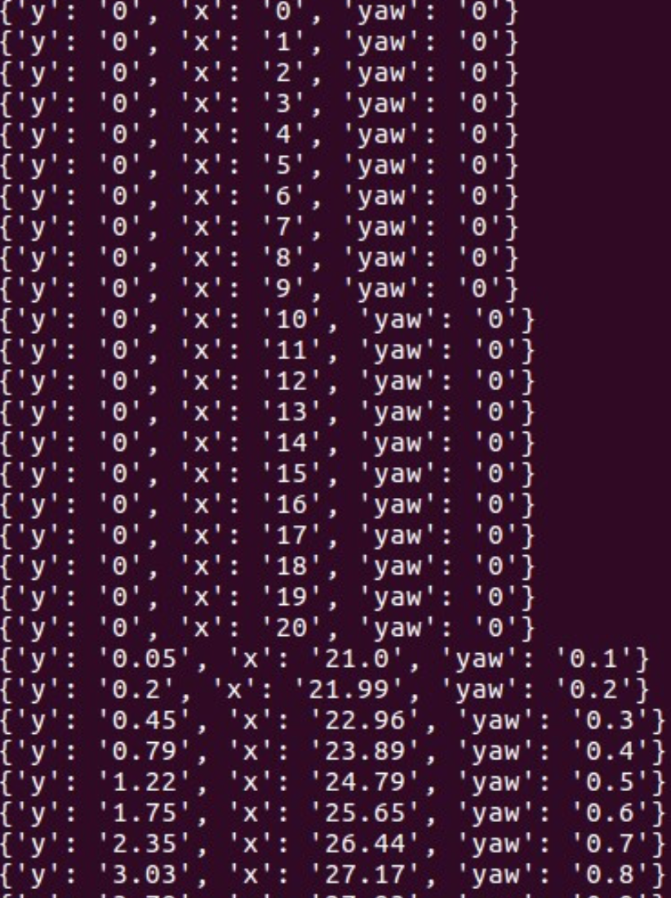
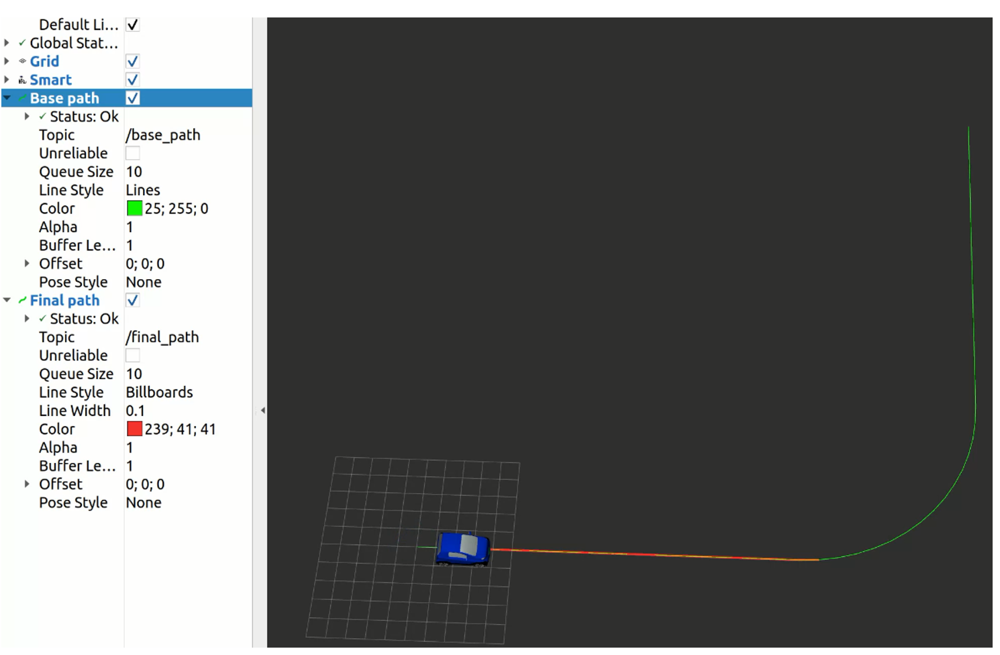
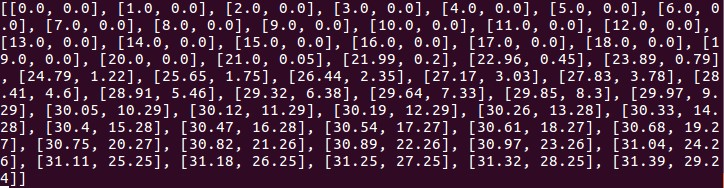
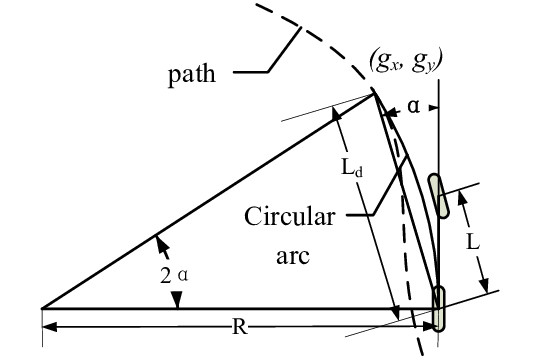
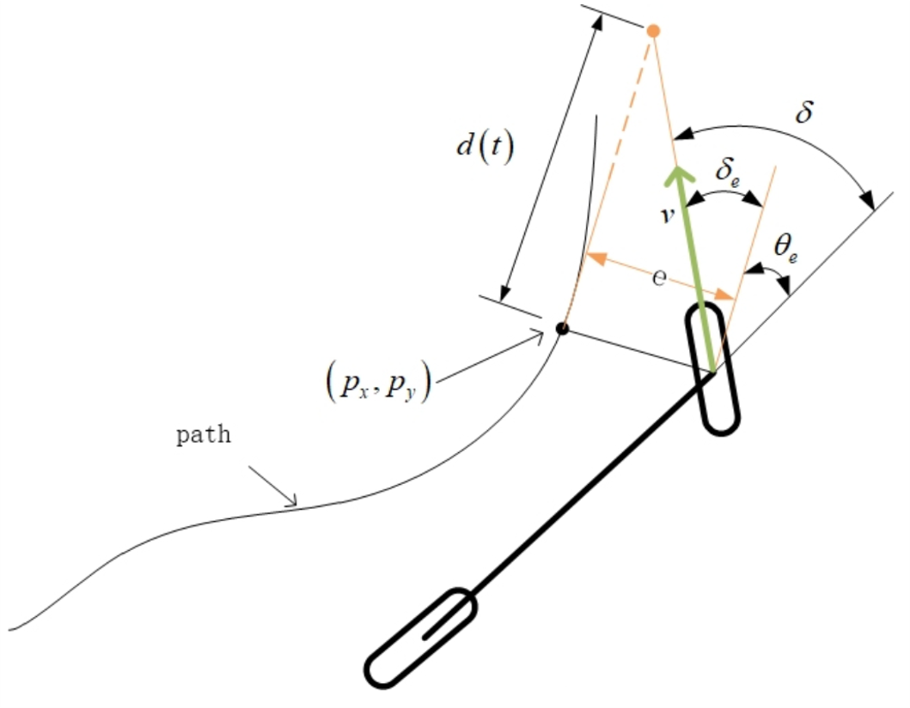

## 11.17周报

> 本周工作：ROS系统自动驾驶控制仿真
>
> 代码详读（ros control，path）；
>
> ros+pure pursuit;
>
> ros+stanley pursuit;
>
> 下周计划：
>
> ros+lqr

### 1. ros control

本节记录urdf模型建立完成能够导入gazabo后如何添加控制器进行关节的控制。

`control.launch`启动结果

节点图如下所示（/joint_states负责发布所有关节的关节状态，/robot_state_publisher负责tf变换供rviz使用）：


（椭圆表示节点（/gazebo），方块（/smart/joint_states）表示话题消息。箭头表示发送和接收消息）

解析：

- 第一行“ rosparam”通过加载yaml配置文件将控制器设置加载到参数服务器。
- controller_spawner节点通过运行python脚本启动robot的关节速度/位置控制器，该脚本对ros_control控制器管理器进行服务调用。服务调用告诉控制器管理器您想要哪个控制器。 它还加载了第三个控制器，该控制器使用hardware_interfaces发布所有关节的关节状态，并发布/joint_states上话题。
- 最后一行启动一个robot_state_publisher节点，该节点监听来自joint_state_controller的/ joint_states消息，然后将转换发布到/tf。 这使您可以在rviz中查看模拟的机器人以及执行其他任务。

发送命令时，查看节点图：

`rostopic pub -1 /smart/rear_left_velocity_controller/command std_msgs/Float64 "data: 0.5"`



通过终端发送命令使机器人运动，可以发现信息的传递路线是：/rostopic_132917_1668519432629——/smart/rear_left_velocity_controller/command——/gazebo——/smart/joint_states——/smart_state_publisher

编写节点cmdvel2gazebo使用/cml_vel完成对小车速度以及转向的控制。



### 2. 路径信息导入

概述：编写节点来导入csv路径点信息并发布话题消息**waypoints**和**base_path**，其中**waypoints**包含了路径点的位置信息、小车的期望速度和表明小车是前进还是后退的状态位，**base_path**包含了实现Rviz可视化的路径点坐标。

(0)初始化函数

```python
def __init__(self):
	rospy.init_node('waypoint_loader', log_level=rospy.DEBUG)
	
	self.pub = rospy.Publisher('/base_waypoints', Lane, queue_size=1, latch=True)
	self.pub_path = rospy.Publisher('/base_path', Path, queue_size=1, latch=True)

	self.velocity = self.kmph2mps(rospy.get_param('~velocity'))
	self.new_waypoint_loader(rospy.get_param('~path'))
	rospy.spin()
```

- rospy.init_node(‘waypoint_loader’, log_level=rospy.DEBUG)用于初始化ROS节点，在节点完全初始化之前，消息不会出现在/rosout话题上，因此可能看不到初始消息。要想在/rosout上看到logdebug消息，可以将log_level参数传递给rospy.init_node()。
- self.pub = rospy.Publisher(‘/base_waypoints’, Lane, queue_size=1, latch=True)和self.pub_path = rospy.Publisher(‘/base_path’, Path, queue_size=1, latch=True)分别用于创建以/base_waypoints和/base_path为话题消息的发布者。其中latch=True将保存最后发布的消息并将其发送给连接的任何将来的订户，这对于诸如地图等缓慢变化的数据或静态数据很有用。
- self.velocity = self.kmph2mps(rospy.get_param(‘~velocity’))用于加载参数velocity的值，并转换成以m/s为单位。
  self.new_waypoint_loader(rospy.get_param(‘~path’))用于加载参数path所对应的文件路径，并发布相关的话题消息。


(1)主函数

```python
def new_waypoint_loader(self, path):
    if os.path.isfile(path):
        waypoints, base_path = self.load_waypoints(path)
        self.publish(waypoints, base_path)
        rospy.loginfo('Waypoint Loded')
    else:
        rospy.logerr('%s is not a file', path)
```


- `os.path.isfile(path)`用于判断某一对象是否为文件，其中path必须为绝对路径。
- `self.load_waypoints(path)`用于加载.csv文件，并以包含路径信息的消息作为返回值。
- `self.publish(waypoints, base_path)`用于发布话题消息。
- `rospy.loginfo(‘Waypoint Loded’)`用于输出INFO日志信息。
- `rospy.logerr(‘%s is not a file’, path)`当判断该对象不为文件时，输出ERROR日志信息

（2）load_waypoints()路径加载函数

```python
def load_waypoints(self, fname):
	waypoints = []
	base_path = Path()
	base_path.header.frame_id = 'world'
	with open(fname) as wfile:
		reader = csv.DictReader(wfile, CSV_HEADER)
		for wp in reader:
			p = Waypoint()
			p.pose.pose.position.x = float(wp['x'])
			p.pose.pose.position.y = float(wp['y'])
			q = self.quaternion_from_yaw(float(wp['yaw']))
			p.pose.pose.orientation = Quaternion(*q)
			p.twist.twist.linear.x = float(self.velocity)
			p.forward = True
			waypoints.append(p)

			path_element = PoseStamped()
			path_element.pose.position.x = p.pose.pose.position.x
			path_element.pose.position.y = p.pose.pose.position.y
			base_path.poses.append(path_element)		
	waypoints = self.decelerate(waypoints)
	return waypoints,base_path
```

- waypoints = []创建了一个空列表，命名为waypoint。

- base_path = Path()和base_path.header.frame_id = 'world’, 定义了一个Path类的对象base_path，并以world作为frame id。

- with open(fname) as wfile的作用是打开文件（保证在文件出错后能够正常关闭文件），其中fname在此处是文件的绝对路径。

- reader = csv.DictReader(wfile, CSV_HEADER)以CSV_HEADER的构造格式，即‘x’、‘y’和‘yaw’格式读取文件内容。

- for wp in reader:在此处遍历文件中的每一行。

- p = Waypoint()定义了一个Waypoint类的对象，其中Waypoint类在styx_msgs文件夹的Waypoint.msg中进行了自定义，包含了geometry_msgs/PoseStamped pose、geometry_msgs/TwistStamped twist和bool forward，分别表示小车在环境中的x、y坐标、小车的期望速度以及表明小车是前进还是后退的标志位。

  

- p.pose.pose.position.x = float(wp[‘x’])和p.pose.pose.position.y = float(wp[‘y’])用于将文件中的x、y所对应的数据填充到相应的消息内容中。

- q = self.quaternion_from_yaw(float(wp[‘yaw’]))即调用tf.transformations.quaternion_from_euler(0., 0., yaw)该函数，用于将 (0., 0., yaw)欧拉角转换成四元数quaternion。

- p.pose.pose.orientation = Quaternion(*q)该操作相当于p.pose.pose.orientation = Quaternion(q[0], q[1], q[2], q[3])，用于将元组扩展成参数列表，并将四元数数据填充到相应的消息内容中。

- p.twist.twist.linear.x = float(self.velocity)用于将期望的线速度值填充到相应的消息内容中，此处期望速度在launch文件中定义。

- waypoints.append()用于将Waypoint类的对象p，即路径信息添加到列表waypoints中。

- path_element = PoseStamped()定义了一个PoseStamped类的对象，用于在Rviz中可视化路径。

- waypoints = self.decelerate(waypoints)根据小车当前位置与终点位置来控制小车速度，并保证在终点位置速度为零。
  

(3) decelerate()小车减速函数

```python
def decelerate(self, waypoints):
	last = waypoints[-1]
	last.twist.twist.linear.x = 0.
	for wp in waypoints[:-1][::-1]:
		dist = self.distance(wp.pose.pose.position, last.pose.pose.position)
		vel = math.sqrt(2 * MAX_DECEL * dist)
		if vel < 1.:
			vel = 0.
		wp.twist.twist.linear.x = min(vel, wp.twist.twist.linear.x)
	return waypoints
```

- last = waypoints[-1]用于将waypoints列表中的最后一个值，即路径的终点信息赋给变量last。
- for wp in waypoints[:-1]\[::-1]:用于遍历waypoints列表中的所有值。
- dist = self.distance(wp.pose.pose.position, last.pose.pose.position)用于计算当前坐标点与终点坐标的距离。
- vel = math.sqrt(2 * MAX_DECEL * dist)根据小车当前位置距离终点的路程dist、人为设定的减速度MAX_DECEL和到达终点时的速度（速度为零）来计算得到小车当前的期望速度vel，其中所运用到的是高中物理公式Vt^2^ - V0^2^ = 2as。
- wp.twist.twist.linear.x = min(vel, wp.twist.twist.linear.x)表示在距离终点较远的位置，按照wp.twist.twist.linear.x的默认期望速度行驶，而在距离终点较近的位置，按照自定义的减速度开始减速行驶。
  

### 3. 局部路径更新



2中将全局路径导入并发布/Path话题，用于rviz中可视化显示，而用于路径控制则需要局部路径的更新，**waypoint_updater.py**文件的功能是通过**KD-tree**查询距离小车最近的路径点，以该点为起始点设置局部路径，并在Rviz可视化工具中显示局部路径。

(0)初始化函数

```python
def __init__(self):
	rospy.init_node('waypoint_updater')

	rospy.Subscriber('/smart/rear_pose', PoseStamped, self.pose_cb)
	rospy.Subscriber('/base_waypoints', Lane, self.waypoints_cb)

	self.final_waypoints_pub = rospy.Publisher('final_waypoints', Lane, queue_size=1)
	self.final_path_pub = rospy.Publisher('final_path', Path, queue_size=1)
	self.final_waypoints_pub = rospy.Publisher('real_waypoints', Lane, queue_size=1)
	self.final_path_pub = rospy.Publisher('real_path', Path, queue_size=1)

	# TODO: Add other member variables you need below
	self.real_waypoints = []
	self.base_waypoints = None
	self.waypoints_2d = None
	self.waypoint_tree = None
	self.pose = None

	# rospy.spin()
	rate = rospy.Rate(20)
	while not rospy.is_shutdown():
		if self.pose and self.base_waypoints and self.waypoint_tree:
			# Get closest waypoint
			closest_waypoint_idx = self.get_closest_waypoint_idx()
			self.publish_waypoints(closest_waypoint_idx)
		rate.sleep()
```

- rospy.init_node(‘waypoint_updater’)用于初始化ROS节点。
- rospy.Subscriber(‘/smart/rear_pose’, PoseStamped, self.pose_cb)和rospy.Subscriber(‘/base_waypoints’, Lane, self.waypoints_cb)分别用于创建以/smart/rear_pose和/base_waypoints为话题消息的订阅者，其中/smart/rear_pose话题消息内容为小车后轮中心点的坐标，/base_waypoints 话题消息内容为全局路径点坐标及小车期望速度等，pose_cb和waypoints_cb分别为/smart/rear_pose和/base_waypoints的消息回调函数。
- self.final_waypoints_pub = rospy.Publisher(‘final_waypoints’, Lane, queue_size=1)和self.final_path_pub = rospy.Publisher(‘final_path’, Path, queue_size=1)分别创建以final_waypoints和final_path为话题消息的发布者，用于发布局部路径信息。
- self.final_waypoints_pub = rospy.Publisher(‘real_waypoints’, Lane, queue_size=1)和self.final_path_pub = rospy.Publisher(‘real_path’, Path, queue_size=1)分别创建以real_waypoints和real_path为话题消息的发布者，用于发布历史路径信息。
- rate = rospy.Rate(20)用于设置ROS节点的更新频率为20Hz。
- while not rospy.is_shutdown():表示在ROS节点未关闭的条件下，执行下面的操作。
  if self.pose and self.base_waypoints and self.waypoint_tree:表示在pose、base_waypoints和waypoint_tree话题消息内容非空的条件下，执行下面的操作。
- closest_waypoint_idx = self.get_closest_waypoint_idx()的作用是返回一个距离当前小车位置最近的路径点的横坐标x。
  self.publish_waypoints(closest_waypoint_idx)用于发布话题消息closest_waypoint_idx。

(1)小车位置/路径点回调函数

```python
def pose_cb(self, msg):
	self.pose = msg
	
def waypoints_cb(self, waypoints):
	self.base_waypoints = waypoints
	if not self.waypoints_2d:
		self.waypoints_2d = [[waypoint.pose.pose.position.x, waypoint.pose.pose.position.y] for waypoint in waypoints.waypoints]
		self.waypoint_tree = KDTree(self.waypoints_2d)
```

- pose_cb()函数为/smart/rear_pose话题消息的回调函数，作用是将该话题消息内容赋给self.pose。

- waypoints_cb()函数为/base_waypoints话题消息的回调函数;

- self.waypoints_2d将waypoints话题消息中的x、y轴坐标提取到一个二维列表self.waypoints_2d中。二维列表self.waypoints_2d的内容如下：

  

- KDTree(self.waypoints_2d)的作用是构建一个二维的KD-tree，用于快速搜索。

(2)get_closest_waypoint_idx()最近路径点获取函数

```python
def get_closest_waypoint_idx(self):
	x = self.pose.pose.position.x
	y = self.pose.pose.position.y
	q = Waypoint()
	q.pose.pose.position.x = x
	q.pose.pose.position.y = y
	self.real_waypoints.append(q)

	closest_idx = self.waypoint_tree.query([x,y],1)[1]
	return closest_idx
```

- q = Waypoint()的作用是创建一个Waypoint类型的对象q，包含坐标点信息。
- self.real_waypoints.append(q)的作用是将最新的实时位置信息添加到列表中。
- closest_idx = self.waypoint_tree.query([x,y],1)[1]的作用是在KD-tree中查询距离当前小车位置最近的一个路径点的横坐标x。

(3) publish_waypoints()消息发布函数

```python
def publish_waypoints(self, closest_idx):
	# fill in final waypoints to publish
	lane = Lane()
	lane.header = self.base_waypoints.header
	lane.waypoints = self.base_waypoints.waypoints[closest_idx : closest_idx+LOOKAHEAD_WPS]

	real_lane = Lane()
	real_lane.header = self.base_waypoints.header
	real_lane.waypoints = self.real_waypoints

	# fill in path for visulization in Rviz
	path = Path()
	path.header.frame_id = '/world'
	for p in lane.waypoints:
		path_element = PoseStamped()
		path_element.pose.position.x = p.pose.pose.position.x
		path_element.pose.position.y = p.pose.pose.position.y
		path.poses.append(path_element)

	real_path = Path()
	real_path.header.frame_id = '/world'
	for m in real_lane.waypoints:
	real_path_element = PoseStamped()
	real_path_element.pose.position.x = m.pose.pose.position.x
	real_path_element.pose.position.y = m.pose.pose.position.y
	real_path.poses.append(real_path_element)

	self.final_waypoints_pub.publish(lane)
	self.final_path_pub.publish(path)
	self.final_waypoints_pub.publish(real_lane)
	self.final_path_pub.publish(real_path)
```

- lane = Lane()的作用是创建一个Lane类型的对象lane。
- lane.waypoints = self.base_waypoints.waypoints[closest_idx:closest_idx + LOOKAHEAD_WPS]的作用是将距离小车最近的路径点以及之后的LOOKAHEAD_WPS个路径点信息填充到final_waypoints话题消息中，其中LOOKAHEAD_WPS是自定义的局部路径点个数。
- path.header.frame_id = '/world’设置/world为局部路径可视化的参考系坐标。
- for p in lane.waypoints:的作用是遍历上述的局部路径点。
- path_element.pose.position.x = p.pose.pose.position.x和path_element.pose.position.y = p.pose.pose.position.y是将局部路径点的坐标信息填充到final_path话题信息中，用于在Rviz可视化工具中显示局部路径。
- self.final_waypoints_pub.publish(lane)和self.final_path_pub.publish(path)的作用是发布话题消息final_waypoints和final_path。
  历史路径消息real_path和real_lane的创建和定义同理。


### 4. Pure pursuit

#### (1) 话题的订阅与发布

```python
rospy.init_node('pure_persuit', log_level=rospy.DEBUG)
rospy.Subscriber('/rear_pose', PoseStamped, self.pose_cb, queue_size = 1)
rospy.Subscriber('/velocity', TwistStamped, self.vel_cb, queue_size = 1)
rospy.Subscriber('/final_waypoints', Lane, self.lane_cb, queue_size = 1)
self.twist_pub = rospy.Publisher('/smart/cmd_vel', Twist, queue_size = 1)
```

- 创建了三个ROS话题订阅者，分别向ROS系统订阅/rear_pose、/velocity和/final_waypoints三种话题消息，即小车后轮轴中心点坐标、小车速度和局部路径点信息，而这三种话题消息对应的回调函数分别为pose_cb、vel_cb和lane_cb。

```python
def pose_cb(self,data):
	self.currentPose = data
def vel_cb(self,data):
	self.currentVelocity = data
def lane_cb(self,data):
	self.currentWaypoints = data
```

- 这三个回调函数分别将/rear_pose、/velocity和/final_waypoints的话题消息内容提取出来，赋给self.currentPose、self.currentVelocity和self.currentWaypoints。

#### (2) loop()函数

```python
def loop(self):
    rate = rospy.Rate(20)
    rospy.logwarn("pure persuit starts")
    while not rospy.is_shutdown():
        if self.currentPose and self.currentVelocity and self.currentWaypoints:
            twistCommand = self.calculateTwistCommand()
            self.twist_pub.publish(twistCommand)
            rate.sleep()
```

- rate = rospy.Rate(20)设置该函数的循环频率为20Hz，即50ms计算一次误差控制量并发布到/smart/cmd_vel。
- while not rospy.is_shutdown():表示若ROS未被关闭，则进行以下操作。
- if self.currentPose and self.currentVelocity and self.currentWaypoints:表示若self.currentPose、self.currentVelocity和self.currentWaypoints均为非空时，则进行以下操作。

#### (3) calculateTwistCommand()

```python
def calculateTwistCommand(self):
    lad = 0.0 #look ahead distance accumulator
    targetIndex = len(self.currentWaypoints.waypoints) - 1
    for i in range(len(self.currentWaypoints.waypoints)):
        if((i+1) < len(self.currentWaypoints.waypoints)):
            this_x = self.currentWaypoints.waypoints[i].pose.pose.position.x
            this_y = self.currentWaypoints.waypoints[i].pose.pose.position.y
            next_x = self.currentWaypoints.waypoints[i+1].pose.pose.position.x
            next_y = self.currentWaypoints.waypoints[i+1].pose.pose.position.y
            lad = lad + math.hypot(next_x - this_x, next_y - this_y)
            if(lad > HORIZON):
                targetIndex = i+1
                break
```

- lad = 0.0设置的是前瞻距离。
- targetIndex = len(self.currentWaypoints.waypoints) – 1的作用是获取局部路径的长度(局部路径点的数量)，并设置列表的大小，其中len(self.currentWaypoints.waypoints)的值就等于waypoints_updater.py中设置的LOOKAHEAD_WPS。
- math.hypot(x,y)用于计算欧式距离；
- this_x和this_y表示当前最近的局部路径点横、纵坐标，next_x和next_y表示下一个路径点的横、纵坐标。计算当前路径点与下一个路径点的距离，并累加到前瞻距离lad。当前瞻距离lad达到阈值HORIZON时，将该点设置为目标路径点，即targetWaypoint。作用是计算局部路径中每两点之间的一段距离之和，一直累加到HORIZON(预瞄距离)为止，记录此点的index。

```python
    targetWaypoint = self.currentWaypoints.waypoints[targetIndex]
    targetSpeed = self.currentWaypoints.waypoints[0].twist.twist.linear.x

    targetX = targetWaypoint.pose.pose.position.x
    targetY = targetWaypoint.pose.pose.position.y		
    currentX = self.currentPose.pose.position.x
    currentY = self.currentPose.pose.position.y
    #get vehicle yaw angle
    quanternion = (self.currentPose.pose.orientation.x, self.currentPose.pose.orientation.y, self.currentPose.pose.orientation.z, self.currentPose.pose.orientation.w)
    euler = tf.transformations.euler_from_quaternion(quanternion)
    yaw = euler[2]
    #get angle difference
    alpha = math.atan2(targetY - currentY, targetX - currentX) - yaw
    l = math.hypot(currentX - targetX,currentY - targetY)
    if(l > 0.5):
    theta = math.atan(2 * 1.868 * math.sin(alpha) / l)
    # #get twist command
    twistCmd = Twist()
    twistCmd.linear.x = targetSpeed
    twistCmd.angular.z = theta 
    else:
    twistCmd = Twist()
    twistCmd.linear.x = 0
    twistCmd.angular.z = 0

    return twistCmd
```

左图所示为Pure pursuit原理图


- 目标是求前轮转角$\theta$，由[纯追踪算法](https://blog.csdn.net/baoli8425/article/details/116808139)可知$\theta=tan^{-1}(\frac{2L\sin \alpha}{l_d})$，*α*表示目前车身姿态和目标路点的夹角，$l_d$表示车辆当前位置(即后轴置)到目标路点的距离。

- 当l_d < 0.5，即小车快要到达全局路径的终点时，直接将小车速度设置为0。反之，则通过Pure Persuit算法得到前轮转向角度，再将该角度与速度值(默认一直最大)通过`self.twist_pub.publish(twistCommand)`发送到`/smart/cmd_vel`话题中，从而实现对小车横向和纵向控制，使其能够沿着全局路径行驶。

### 5. Stanley pursuit

#### (1) 话题的订阅与发布

```python
rospy.init_node('pure_persuit', log_level=rospy.DEBUG)
rospy.Subscriber('/front_pose', PoseStamped, self.pose_cb, queue_size = 1)
rospy.Subscriber('/velocity', TwistStamped, self.vel_cb, queue_size = 1)
rospy.Subscriber('/final_waypoints', Lane, self.lane_cb, queue_size = 1)
self.twist_pub = rospy.Publisher('/smart/cmd_vel', Twist, queue_size = 1)
```

- 创建了三个ROS话题订阅者，分别向ROS系统订阅/front_pose、/velocity和/final_waypoints三种话题消息，即小车前轮轴中心点坐标、小车速度和局部路径点信息，而这三种话题消息对应的回调函数分别为pose_cb、vel_cb和lane_cb。

```python
def pose_cb(self,data):
	self.currentPose = data
def vel_cb(self,data):
	self.currentVelocity = data
def lane_cb(self,data):
	self.currentWaypoints = data
```

- 这三个回调函数分别将/front_pose、/velocity和/final_waypoints的话题消息内容提取出来，赋给self.currentPose、self.currentVelocity和self.currentWaypoints。

#### (2) loop()函数

```python
def loop(self):
    rate = rospy.Rate(20)
    rospy.logwarn("pure persuit starts")
    while not rospy.is_shutdown():
        if self.currentPose and self.currentVelocity and self.currentWaypoints:
            twistCommand = self.calculateTwistCommand()
            self.twist_pub.publish(twistCommand)
            rate.sleep()
```

#### (3)calculateTwistCommand()

```python
#get waypoint yaw angle
    waypoint_quanternion = (targetWaypoint.pose.pose.orientation.x, targetWaypoint.pose.pose.orientation.y, targetWaypoint.pose.pose.orientation.z, targetWaypoint.pose.pose.orientation.w)
    waypoint_euler = tf.transformations.euler_from_quaternion(waypoint_quanternion)
    TargetYaw = waypoint_euler[2]
    # print 'TargetYaw = ', TargetYaw

    #get vehicle yaw angle
    quanternion = (self.currentPose.pose.orientation.x, self.currentPose.pose.orientation.y, self.currentPose.pose.orientation.z, self.currentPose.pose.orientation.w)
    euler = tf.transformations.euler_from_quaternion(quanternion)
    CurrentYaw  = euler[2]

    #get the difference between yaw angle of vehicle and tangent line of waypoint
    alpha = TargetYaw - CurrentYaw

    #get the error between target position and current position
    if alpha >= 0:
    error = abs( math.hypot(currentX - nearestX, currentY - nearestY))
    else:
    error = -abs( math.hypot(currentX - nearestX, currentY - nearestY))

    #get the velocity of vehicle
    vel = math.hypot(self.currentVelocity.twist.linear.x,self.currentVelocity.twist.linear.y)
    #get the nonlinear proportional function from geometry of Vehicular mobility model
    delta = math.atan(k * error / vel)

    l = math.sqrt(math.pow(currentX - targetX, 2) + math.pow(currentY - targetY, 2))
    if(l > 0.5):
    theta = alpha + delta
    # #get twist command
    twistCmd = Twist()
    twistCmd.linear.x = targetSpeed
    twistCmd.angular.z = theta 
    else:
    twistCmd = Twist()
    twistCmd.linear.x = 0
    twistCmd.angular.z = 0

    return twistCmd
```

左图为Stanley控制原理图，前轮转角$\delta=\delta _e+\theta_e=\arctan \frac{k\cdot e\left( t \right)}{v\left( t \right)}+\theta_e$


